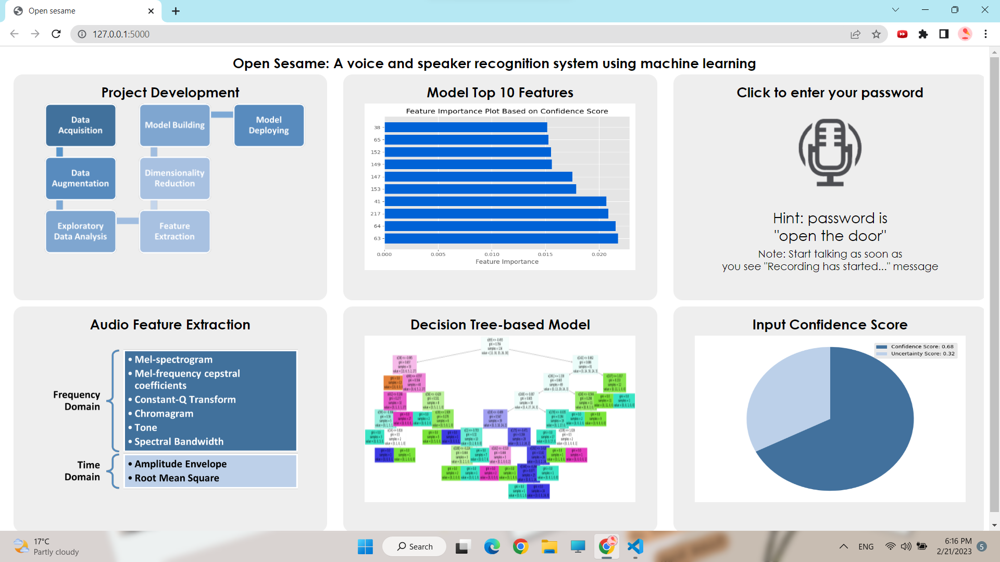

# A voice and speaker recognition system using machine learning

  - [Data](#data)
  - [Description](#description)
  - [Machine Learning Process](#machine-learning-process)
  - [Task-Info](#task-info)
  - [Preview](#preview)

## Data
- Every member of the team recorded equal number of voice records with equal number of categories. 
- Hierarchy:
  - DSP_Data_New
    - blank (blank audios)
    - close the door
    - open the door
    - unlock the door
  - DSP_Data_Verification
    - open the door (password)
    - others

## Description
   - This is a web app that can recognize speech and verify voices in a form of Voice Command Door Lock that opens if the owners say the correct password "open the door".
   - The web page is an E-poster contains some information about the used data features, ML pipeline, the decision tree of the model , a section to test the app and a pie chart to show the confidence score of the result.

## Machine Learning Process
 - We have followed the full machine learning pipeline used in the industry, from data acquisition to models deployment, and here are the steps:
    - 1- <strong>Data Acquisition </strong>
    - 2- <strong>Data Augmentation </strong>:to increase the amount of data to be trained by generating new data points from existing data to improve the performance and outcomes of the model.
    - 3- <strong>Exploratory Data Analysis "EDA" </strong>: to analyze the data using visual techniques that led us to take all features in frequency domain and only two features (AE,RMSE) in time domain

      *note: we mainly have two models ,one for speech recognition and the other for voice verifying, the next steps are applied to both of them.*

    - 4- <strong>Feature extraction and Dimensionality reduction </strong>:
    to reduce the number of features and only take the most efficient ones.
    - 5- <strong>Building The model</strong>: according to the accuracy we used random forest with its best hyper-parameters,
    the accuracy of the voice verifying model was 84% and the accuracy of the speech recognition model was 60% and because it's relatively low we imported an external model that convert speech to text to detect the password.
    - 6- <strong>Models deployment</strong>

 

## Task-Info
- Digital Signal Processing (SBE3110) class task 4 created by Team 9:

  | Names               | Section | Bench Number |
  | ------------------- |--------------| ------------ |
  | Mahmoud Yaser       |    2    | 30           |
  | Ahmed El Sarta      |    1    | 8            |
  | Adham Mohamed       |    1    | 9            |
  | Maha Medhat         |    2    | 38           |

- Languages & Frameworks
  - Python (Machine Learning)
  - HTML, CSS, JavaScript (Frontend)
  - Flask (Backend)

- Submitted to: Dr. Tamer Basha & Eng. Abdallah

## Preview
  
  

All rights reserved © 2022 to our Team - Systems & Biomedical Engineering, Cairo University (Class 2024)
